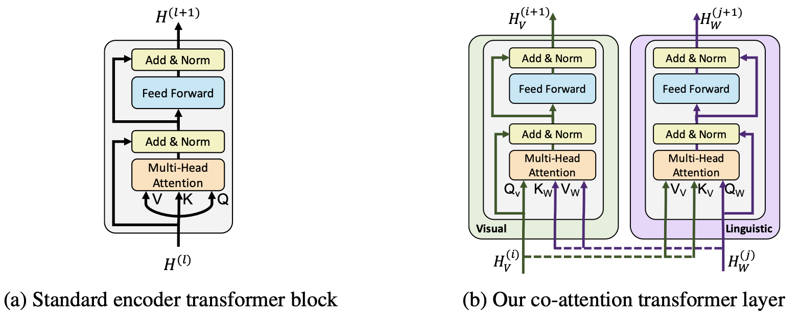
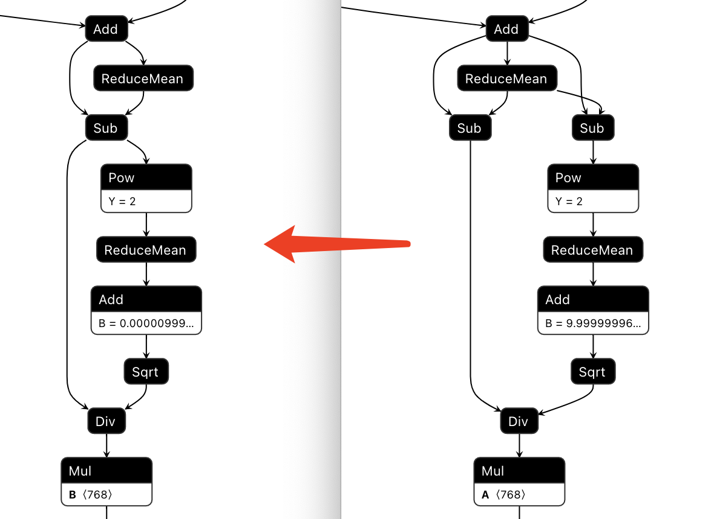
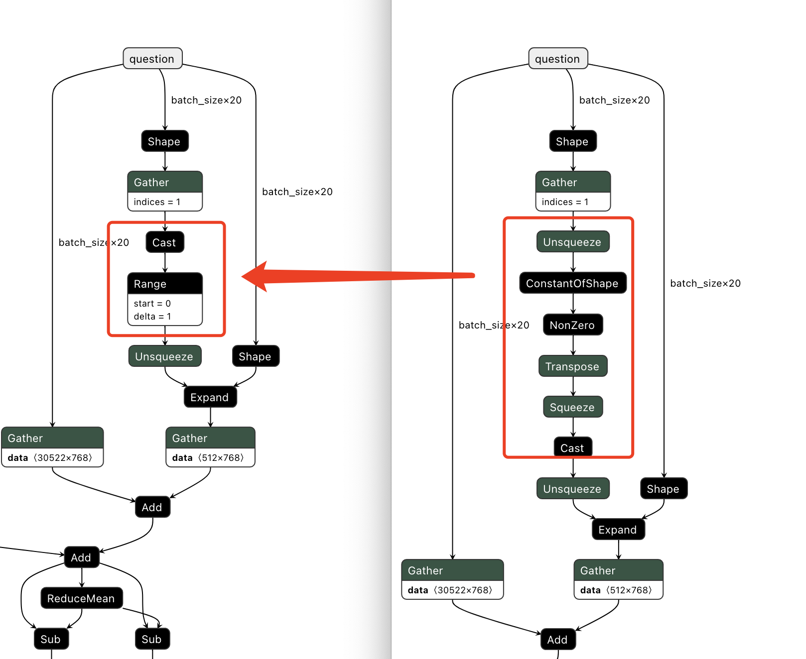
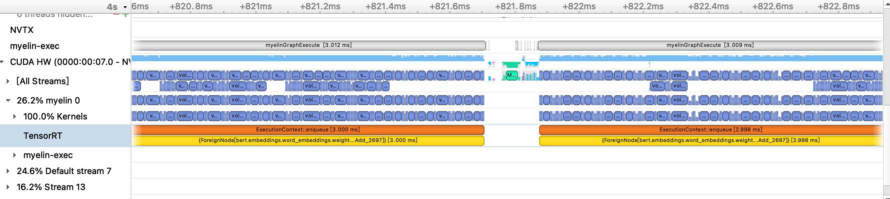
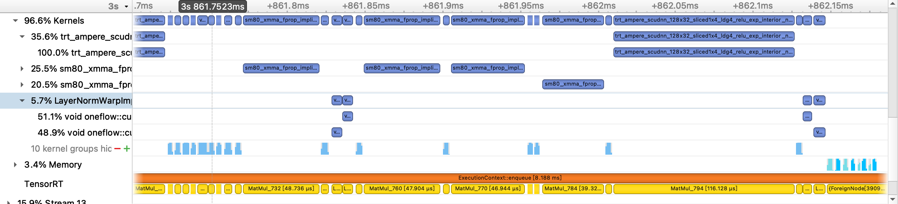
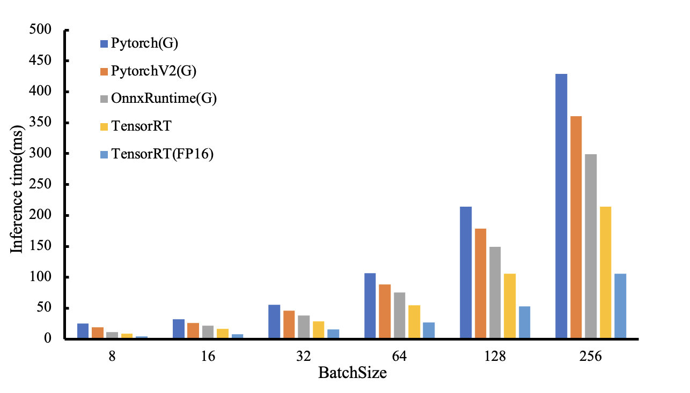

# TRT2022_VilBERT

赛题：https://tianchi.aliyun.com/competition/entrance/531953/rankingList

本项目是基于ViLBERT进行TensorRT的部署。ViLBERT模型是为视觉-语言任务训练非任务专用的视觉语言表征的BERT融合模型，可以学习视觉内容和文本内容的与特定任务无关的联合表征。

原始论文：[ViLBERT: Pretraining Task-Agnostic Visiolinguistic Representations for Vision-and-Language Tasks](https://arxiv.org/abs/1908.02265)

原始模型参考：https://github.com/jiasenlu/vilbert_beta

### 项目摘要
ViLBERT模型的评测有Image Retrieval、VQA、VCR及RefCOCO+等任务，由于任务数据的复杂性，因此本项目主要针对`RefCOCO+`任务进行评测。
本项目首先基于评测任务对原始的`Pytorch`模型进行模型的精剪，去除对评测任务无关的层，并对运行流程进行简化。其次针对转化`Onnx`模型转化及`TensorRT`转化等问题进行原始模型层的替换及版本替换，从而顺利进行模型的转换。接着进行基于`OnnxRuntime`的推理评测，速度相对于pytorch有一定的提升。然后针对`TensorRT`尝试进行`FP16`精度的推理，虽然评测指标没有影响，但是输出的`logit`误差较大，因此使用`polygraphy`工具进行`onnxruntime`及`trt`的推理输出结果对比，在设置`mark all`参数有误后使用二分法进行层的结果对比，使用`strict type`显式控制某些层的计算精度。其次使用`onnx_graphsurgeon`对原始图进行`layernorm`的算子融合，并基于cuda编程编写了对应的`plugin`算子，在初赛中编写layernorm-plugin有一定的速度提升，但本模型推理时间会变长，使用`nsightsystems`工具进行耗时的评估观察，发现新增了部分新的更耗时的节点。除此之外也尝试了编写calibrator进行`INT8`的推理，最终未评测。

### 模型简介：
ViLBERT在将BERT由单一的文本模态扩展为多模态双流模型。文本流和视觉流通过注意力Transformer层进行交互。这种结构在多模态下能分别对不同的模态进行处理，并提供模态之间的交互。如下图的transformer结构。

ViLBERT学习的是静态图像及其对应描述文本的联合表征，分别对两种模态进行建模，然后通过一组attention-based的interaction将它们merge在一起。对每种模态都可使用不同深度的网络，并支持不同深度的跨模态交互。
在Conceptual Captions数据集上进行pretrain时的训练目标有两个：(1)给定输入，预测被遮蔽的字和图像区域的语义；(2)预测图像和文本是否语义匹配。在预训练之后将模型四个4个vision-and-language 任务：(1)视觉问答；(2)视觉常识推理；(3)指示表达；(4)基于字幕的图像检索，并且都取得了stat-of-the-art的结果。ViLBERT在各个任务上都提升了2~10个百分点的精度。


### 运行环境：

##### 硬件环境
+ GPU: NVIDIA A10
+ Driver Version: 510.73.08
+ CUDA: 11.6
+ Docker：registry.cn-hangzhou.aliyuncs.com/trt2022/trt-8.4-ga
+ TensorRT: 8.4.1.5

##### 主要Python环境
+ onnx==1.11.0
+ onnx-graphsurgeon==0.3.19
+ onnxruntime-gpu==1.11.1
+ pytorch-pretrained-bert==0.6.2
+ torch==1.8.1+cu111


### 项目结构：

```shell
.
├── README.md
├── requirements.txt
├── fig
├── infer_batch_inputs
│   ├── save_input_features_batch_all            # 原始文件生成的推理数据
│   └── save_input_features_with_model_res       # 含有torch模型的target、logit、batch_loss、batch_score的推理数据
├── libs
├── logs                            # 相关脚本运行日志
├── models
│   └── readme.md                   # onnx 及 trt plan存放路径
├── plugins
│   ├── Makefile.inc
│   └── LayerNormPlugin             # trt plugin路径
├── scores                          # 评测结果存放路径
├── script                          # 运行shell脚本
├── src
│   ├── calibrator.py               # int8推理所需的校准器
│   ├── onnx2plan.py                # onnx转plan
│   ├── onnx_optimize.py            # onnx图优化
│   └── testVilBertTrt.py           # tensorrt推理评测
├── test                            # 测试脚本
└── vilbert_pytorch
    ├── README.md
    ├── config                      # 模型配置
    ├── convert_onnx.py             # torch模型转onnx
    ├── data                        # 原始数据
    ├── eval_tasks.py
    ├── gen_input_batch.py          # 产出Batch评测数据
    ├── onnx_test.py                # onnx推理评测
    ├── requirements.txt
    ├── save                        # torch模型所需的预训练模型
    ├── script
    ├── tools
    ├── torch_model_test.py         # torch模型推理评测
    ├── vilbert
    └── vlbert_tasks.yml
```


### 运行流程：

##### 环境准备
```shell
1. docker pull registry.cn-hangzhou.aliyuncs.com/trt2022/trt-8.4-ga
2. nvidia-docker run -it --name trt2022_trt84 --privileged=true -v /TRT2022_VilBERT/:/TRT2022_VilBERT/ registry.cn-hangzhou.aliyuncs.com/trt2022/trt-8.4-ga
3. cd /TRT2022_VilBERT && pip install -r requirements.txt
```

##### 1. 参考vilbert_pytorch准备预训练模型及RefCOCO+所需数据

(在参考项目的基础上添加以下脚本及修改部分脚本简化流程)
##### 2. 准备评测所需Batch数据
```shell
sh script/gen_inputs.sh
```

##### 跳过前两步，数据下载

链接: https://pan.baidu.com/s/1a6Mb-Xrr6F5lO-N7_UKlGw  密码: ssjf  
将`save_input_features_with_model_res`放至`infer_batch_inputs`目录下  
将`vilbert_model_vision_logit.onnx`、`pytorch_model_19.bin`放至`models`目录下


##### 3. Pytorch推理评测
```shell
sh script/torch_infer.sh
```
##### 4. Pytorch转Onnx
```shell
sh script/torch2onnx.sh
```
##### 5. OnnxRuntime推理评测
```shell
sh script/onnxruntime_infer.sh
```
##### 6. Onnx图优化
```shell
sh script/onnx_optimize.sh
```
##### 7. 编译Plugin算子
```shell
cd plugins/LayerNormPlugin
make clean
make
cp LayerNormPlugin.so /TRT2022_VilBERT/libs
```
##### 8. Onnx转Plan
```shell
sh script/onnx2plan.sh
```
##### 9. TensortRT推理评测
```shell
sh script/tensorrt_infer.sh
```

### 优化细节：

##### 原始模型修改以生成合适的Onnx
原始模型中的LayerNorm是继承`nn.Module`自定义节点，在转为Onnx后发现layernorm节点中`ReduceMean`之后有两个，因此修改原始模型，以torch自带的`nn.LayerNorm`替换原有的节点，导出的Onnx为正常结构。


##### Onnx导出版本及Pytorch版本导致节点生成不同
在`pytorch==1.4`及`opset_version=10`版本下导出Onnx时，出现`NonZero`节点，后续无法进行tensorrt的转换，因此换用`pytorch==1.8`及`opset_version=11`后，Onnx节点进行了合并替换。


##### 使用polygraphy进行FP16精度下的层输出对比
使用`polygraphy`工具进行`onnxruntime`及`trt`的推理输出结果对比，在设置`mark all`参数有误：`[TRT] [E] 2: [myelinBuilderUtils.cpp::operator()::425] Error Code 2: Internal Error ([HostToDeviceCopy] requires bool I/O but node can not be handled by Myelin. Operation is not supported.)`，可见本模型部分node不支持，有些层不支持转为输出节点，因此随后使用二分法进行层的结果对比。

##### nsightsystems耗时分析
基于nsys进行原始模型推理的耗时分析：


在进行layernorm算子融合加入plugin之后：

可见原本已经优化到整体的`bert.embeddings`被拆分成多个小模块，这个应该是耗时增加的主要原因。

##### plugin编写
在初赛中，在学习了官方给出的layernorm plugin之后，去参考了TensorRT、FastTransformer、TurboTransformers及OneFlow等优化开源方案的Kernel编写，应用到自己的模型上也有一定的提升。但是在复赛本模型上进行layernorm算子融合后采用的plugin反而推理耗时近一步增加。

### 性能对比：

具体可见`scores`下的各个结果文件

#### 推理精度评测：
推理精度评估分为模型的最终输出误差对比及评测任务的指标对比

**评测任务指标对比如下：**
| BatchSize |PytorchV2(G) | OnnxRuntime(G) | TensorRT    | TensorRT(FP16) |
| --------- | ---------   | -------------  | -------     | -------------  |
| 8         | 6.38/7.00   | 6.38/7.00      | 6.38/7.00   | 6.38/7.00      |
| 16        | 8.98/13.00  | 8.98/13.00     | 8.98/13.00  | 8.98/13.00     |
| 32        | 7.79/27.00  | 7.79/27.00     | 7.79/27.00  | 7.96/26.00     |
| 64        | 7.16/49.00  | 7.16/49.00     | 7.16/49.00  | 7.25/48.00     |
| 128       | 6.34/99.00  | 6.34/99.00     | 6.34/99.00  | 6.38/98.00     |
| 256       | 6.11/203.00 | 6.11/203.00    | 6.11/203.00 | 6.13/202.00    |

*注：表中数据为`batch_loss/batch_score`*


**模型输出结果误差对比如下：**
| BatchSize | OnnxRuntime(G) | TensorRT    | TensorRT(FP16) |
| --------- | -------------  | -------     | -------------  |
| 8         | 0.00250956742  | 0.00458103  | 0.02872051     |
| 16        | 0.00415383419  | 0.00284276  | 0.02610013     |
| 32        | 0.00978794414  | 0.00986979  | 2.77385377     |
| 64        | 0.02325059846  | 0.03854355  | 2.80445337     |
| 128       | 0.99567425251  | 0.59527492  | 2.80533838     |
| 256       | 0.99567425251  | 0.59527724  | 2.80533838     |

如上所述，虽然模型的输出结果误差较大，但是对最终任务的评测指标几乎没有影响。

#### 推理速度评测：

用同一份输入评测数据：`infer_batch_inputs/save_input_features_with_model_res`
首先进行模型的`warm up`，再进行模型的30次推理，时间取平均

+ Pytorch(C):         原始Vilbert模型在CPU上运行
+ Pytorch(G):         原始Vilbert模型在A10-GPU上运行
+ PytorchV2(G):       优化LayerNorm，用torch.nn.LayerNorm替代自定义BertLayerNorm后的Vilbert模型在A10-GPU上运行
+ OnnxRuntime(G)：    优化后的Vilbert模型在A10-GPU上以OnnxRuntime进行推理
+ TensorRT:           基于Onnx转的Plan模型以TensorRT进行推理
+ TensorRT(FP16):     TensorRT以FP16精度进行推理
+ TensorRT(Opt):      基于优化后的Onnx及优化后的TensorRT进行推理

| BatchSize | Pytorch(C) | Pytorch(G) | PytorchV2(G) | OnnxRuntime(G) | TensorRT | TensorRT(FP16) | TensorRT(Opt) |
| --------- | ---------  | ---------  | ---------    | -------------  | -------  | -------------  | ------------  |
| 8         | 417.57     | 25.33      | 19.41        | 11.31          | 8.70     | 4.81           |               |
| 16        | 984.57     | 31.85      | 26.15        | 21.35          | 16.44    | 8.22           |               |
| 32        | 1508.12    | 55.17      | 46.07        | 38.42          | 28.47    | 15.32          |               |
| 64        | 2553.40    | 106.70     | 88.92        | 75.61          | 54.88    | 27.19          |               |
| 128       | **         | 214.04     | 178.74       | 149.27         | 106.12   | 53.31          |               |
| 256       | **         | 428.90     | 360.32       | 299.14         | 213.98   | 105.69         |               |


